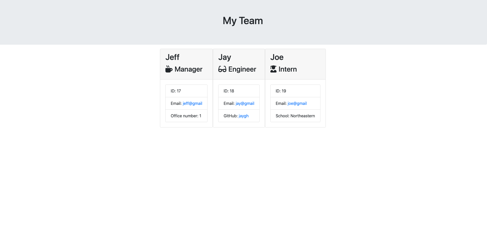

# teamRenderer

## Description
Using Node.js's built in package of fs, as well as inquirer, I built classes and a command line application that uses user input to create a team and cards for the team and writes the team to an html file. This was all done as test-driven development.

## Table of Contents
* [Installation](#installation)
* [Usage](#usage)
* [Tests](#tests)
* [Questions](#questions)

## Installation
After cloning, run npm install to get inquirer.

## Usage
Run node app.js in the terminal to run the application.

## Tests
Run "npm run test" to test the classes and their functionality.

## Questions
<a href="https://github.com/tmessall">Github</a>

Email me at tmessall17@gmail.com with any further questions.
